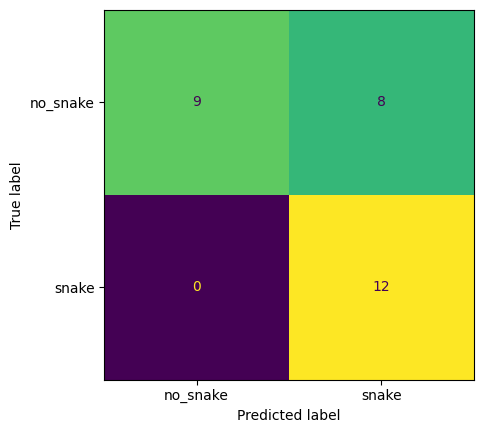
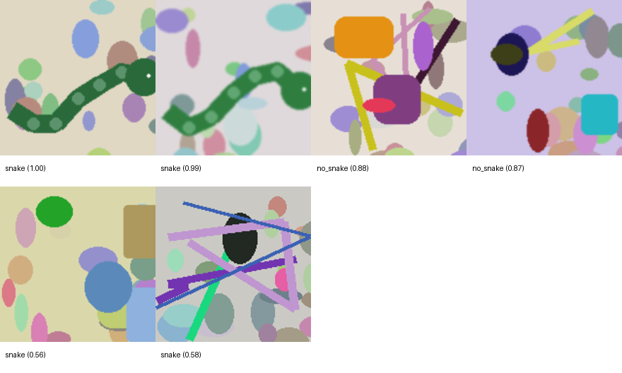
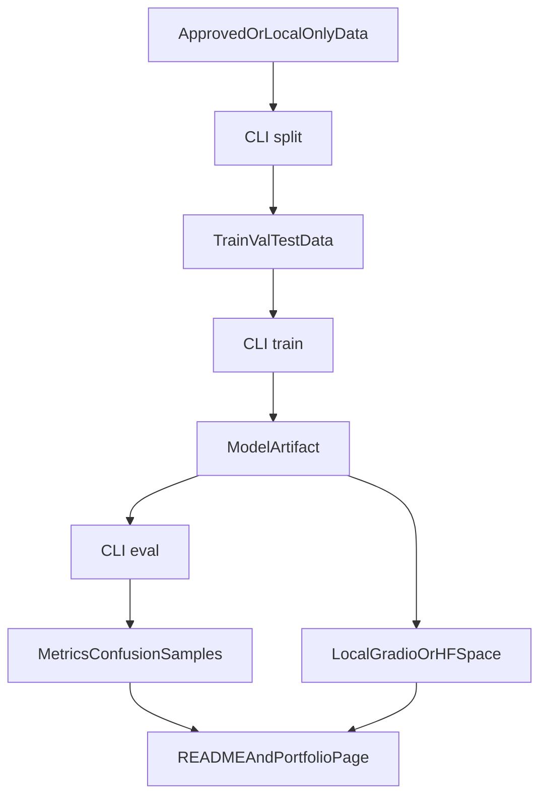

# Snake Detector

Snake Detector is a bounded ML engineering project that turns a Colab-era snake/no-snake image-classifier prototype into a reproducible Python package, CLI workflow, tests, CI, and Gradio demo path.

## What It Is

- Binary image-classification demo: `snake` vs `no_snake`.
- Package-based workflows with documented `split -> train -> eval -> predict` paths.
- Two publication lanes: generated placeholder artifacts for reproducible engineering proof, plus a real-photo iNaturalist-trained model for the live demo.
- Engineering proof package, not field-ready wildlife detection software.

## Status

- Live Hugging Face Space is published: [snake-detector-demo](https://huggingface.co/spaces/mmaitland/snake-detector-demo), with direct app host `https://mmaitland-snake-detector-demo.hf.space`.
- Reproducible CLI flow validated on March 21, 2026.
- The live Space serves a real-photo trained Keras model (`model.keras`) using InceptionV3 preprocessing, 160px inputs, and a 0.76 decision threshold.
- Real model release package: [docs/releases/v1.1.0-real-dataset.md](docs/releases/v1.1.0-real-dataset.md).
- The GitHub README still preserves the older placeholder-safe benchmark as an engineering baseline.
- GitHub Release `v1.1.0-real-dataset` is the intended large-artifact mirror for the real model and evaluation assets.

## Demo

- Live app: [mmaitland-snake-detector-demo.hf.space](https://mmaitland-snake-detector-demo.hf.space)
- Hugging Face Space repo: [huggingface.co/spaces/mmaitland/snake-detector-demo](https://huggingface.co/spaces/mmaitland/snake-detector-demo)
- Local Gradio app: `python app/gradio_app.py`
- Hugging Face Space entrypoint: [`app/gradio_app.py`](app/gradio_app.py), with root [`app.py`](app.py) as a thin re-export.

Portfolio **Try live demo** links and `NEXT_PUBLIC_SNAKE_DEMO_URL` should use `https://mmaitland-snake-detector-demo.hf.space`, not the gallery page. See [docs/hf_space.md](docs/hf_space.md).

## Run Locally

### 1. Create an environment

```bash
python -m venv .venv
.venv\Scripts\python -m pip install -e .[dev,demo]
```

### 2. Generate the approved placeholder dataset

```bash
.venv\Scripts\python -m snake_detector.demo_data --output-dir data/public_demo_raw --samples-per-class 72 --image-size 160 --seed 42
```

### 3. Split the dataset

```bash
.venv\Scripts\python -m snake_detector.cli split --raw-dir data/public_demo_raw --split-dir data/public_demo_split --train-split 0.8 --val-split 0.1 --seed 42
```

### 4. Train the reproducible baseline artifact

```bash
.venv\Scripts\python -m snake_detector.cli train --split-dir data/public_demo_split --model-path artifacts/model.joblib --metrics-path artifacts/metrics.json --image-size 96 --batch-size 16 --epochs 12 --learning-rate 0.001 --seed 42 --backbone sklearn_mlp
```

### 5. Evaluate the saved artifact

```bash
.venv\Scripts\python -m snake_detector.cli eval --split-dir data/public_demo_split --model-path artifacts/model.joblib --metrics-path artifacts/metrics.json --image-size 96 --batch-size 16 --backbone sklearn_mlp
```

### 6. Predict one image

```bash
.venv\Scripts\python -m snake_detector.cli predict --model-path artifacts/model.joblib --image-path data/public_demo_split/testing/snake/snake_039.png --image-size 96
```

### 7. Launch the local demo

```bash
.venv\Scripts\python app/gradio_app.py
```

To mirror the Hugging Face Space entrypoint, install the demo extra and run the root app:

```bash
pip install -e ".[demo]"
python app.py
```

## Evidence

- Real-photo model release package: [docs/releases/v1.1.0-real-dataset.md](docs/releases/v1.1.0-real-dataset.md)
- Benchmark table: [docs/assets/benchmark_table.md](docs/assets/benchmark_table.md)
- Confusion matrix summary: [docs/assets/confusion_matrix.md](docs/assets/confusion_matrix.md)
- Sample prediction summary: [docs/assets/sample_predictions.md](docs/assets/sample_predictions.md)
- Repo before/after summary: [docs/assets/before_after_repo.md](docs/assets/before_after_repo.md)
- Demo capture checklist: [docs/assets/demo_capture.md](docs/assets/demo_capture.md)

Generated source-of-truth files:

- `artifacts/metrics.json`
- `artifacts/confusion_matrix.png` (run output)
- `artifacts/sample_predictions.png` (run output)
- `artifacts/sample_predictions.json`
- `artifacts/model.joblib`
- `docs/assets/confusion_matrix.png` (public README copy)
- `docs/assets/sample_predictions.png` (public README copy)

## Limits

- This is a binary `snake` vs `no_snake` prototype, not species identification software.
- The live demo is trained on real iNaturalist-sourced imagery, but the checked-in README benchmark below is still the older generated-placeholder baseline.
- The original scraped prototype corpus remains excluded from redistribution until each source is rights-cleared.
- The real-photo model is packaged for release as a model/evaluation artifact; raw third-party image files remain out of git.
- Live demo wiring should use the active `*.hf.space` app endpoint, not the `huggingface.co/spaces/...` gallery URL.

## Dataset and Licensing

Three dataset lanes are tracked separately:

1. Original prototype corpus: local-only, rights not verified, excluded from publication.
2. Approved public-safe dataset: generated locally with `python -m snake_detector.demo_data` and used for README/demo artifacts.
3. Real-image retraining lane: iNaturalist manifest + download + training workflow for rights-aware wildlife-photo runs; see [docs/real_image_collection.md](docs/real_image_collection.md) and [docs/collection_runs.md](docs/collection_runs.md).

Legal references:

- [docs/dataset_and_license.md](docs/dataset_and_license.md)
- [docs/dataset_sources.csv](docs/dataset_sources.csv)
- [docs/attribution.md](docs/attribution.md)

## Real-Photo Model Metrics

Release package: [v1.1.0-real-dataset](docs/releases/v1.1.0-real-dataset.md)

Held-out test split: 1,283 iNaturalist-sourced images (`255` snake, `1,028` no-snake) at threshold `0.76`.

| Metric | Value |
| --- | ---: |
| Accuracy | 0.9026 |
| Macro Precision | 0.8652 |
| Macro Recall | 0.8139 |
| Macro F1 | 0.8358 |
| Snake Precision | 0.8095 |
| Snake Recall | 0.6667 |
| Snake F1 | 0.7312 |

## Placeholder-Safe Baseline

Run date: March 21, 2026  
Dataset: 144 generated placeholder images, 29-image held-out test split  
Purpose: validate the reproducible engineering workflow without redistributing unlicensed photos

| Metric | Value |
| --- | ---: |
| Accuracy | 0.7241 |
| Macro Precision | 0.8000 |
| Macro Recall | 0.7647 |
| Macro F1 | 0.7212 |

## Visual Artifacts

Confusion matrix generated from the held-out placeholder test split:



Representative correct and failure cases:



## Architecture



## Deployment Notes

- Portfolio website: Vercel
- Demo host: Hugging Face Spaces (Gradio)
- Live model artifact: Space-side `model.keras`
- Live model config: `image_size=160`, `threshold=0.76`, `preprocessing=inception_v3_preprocess_input`
- GitHub Release mirror: `v1.1.0-real-dataset`
- Older placeholder-safe artifact: [v1.0.0 model.joblib](https://github.com/mmaitland300/Snake-detector/releases/download/v1.0.0/model.joblib)
- Fallback when the live demo is unavailable: local validation evidence + checked-in proof artifacts

Decision record: [docs/deployment_decision.md](docs/deployment_decision.md)

## Resume-Ready Bullets

- Refactored a legacy Colab computer-vision prototype into a package-based CLI workflow with tests, linting, and CI-ready structure, reducing the project to documented split/train/eval/predict paths.
- Added a legally safe publication mode by separating the original unverified dataset from a reproducible 144-image generated placeholder dataset used for public demo and benchmark artifacts.
- Deployed a real-photo trained iNaturalist Keras model to Hugging Face Spaces while keeping the older placeholder-safe benchmark clearly labeled as an engineering baseline.

## Legacy Scripts

Legacy Colab-era scripts are archived under `legacy/` for historical context only and are not part of the primary workflow.
